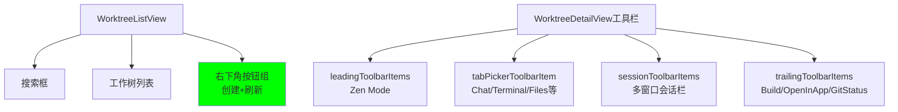

# 按钮调序

## 概述
本任务需要调整按钮的位置：
1. 将 WorktreeListView 中的创建和刷新按钮从工具栏移除，改放到列表页的右下角
2. WorktreeDetailView 工具栏保持当前顺序不变

## 流程图



## 方案

### 当前 WorktreeDetailView 工具栏结构分析

根据代码分析，WorktreeDetailView.swift 中的工具栏结构如下：

1. **leadingToolbarItems** (第372-398行)
   - Zen Mode 按钮

2. **tabPickerToolbarItem** (第178-254行)
   - Chat 按钮
   - Terminal 按钮
   - Files 按钮
   - Browser 按钮
   - Task 按钮
   - Git 按钮
   - 悬浮面板按钮（Files、Browser、Task、Git，仅在 showFloatingPanels 为 true 时显示）

3. **sessionToolbarItems** (第347-371行)
   - 导航箭头（上一个/下一个）
   - 会话标签滚动视图
   - 新建标签按钮

4. **trailingToolbarItems** (第400-444行)
   - Xcode Build 按钮
   - Open In App 按钮
   - Git Status 按钮

**注意**：Zen Mode 按钮在 leadingToolbarItems 中，与 tabPickerToolbarItem 是分开的，不在同一个容器里。

### 当前 WorktreeListView 结构分析

根据代码分析，WorktreeListView.swift 中的结构如下：

1. **搜索框** (第47-68行)
   - 搜索输入框
   - 状态过滤器下拉菜单

2. **工作树列表** (第70-133行)
   - 显示所有工作树

3. **工具栏** (第157-181行)
   - Spacer
   - 创建工作树按钮（plus）
   - 刷新工作树列表按钮（arrow.clockwise）

### 需求分析

用户要求：
- 将 WorktreeListView 工具栏中的创建和刷新按钮移除
- 将这两个按钮放到列表页的右下角

### 修改方案

1. **移除工具栏按钮**
   - 删除 WorktreeListView.swift 中第157-181行的 toolbar 定义

2. **添加右下角按钮组**
   - 在 VStack 中添加一个 ZStack，包含创建和刷新按钮
   - 使用 frame(maxWidth: .infinity, maxHeight: .infinity, alignment: .bottomTrailing) 将按钮定位到右下角
   - 添加适当的 padding 和样式

具体修改步骤：
1. 修改 WorktreeListView.swift 的 body 结构
2. 在列表下方添加右下角按钮组
3. 删除 toolbar 定义

## 相关代码位置

[WorktreeListView.swift - toolbar 定义](vscode://file/Volumes/Cache/codeeditAi/worktrees/20260110-按钮调序/aiX/Views/Worktree/WorktreeListView.swift:157)

## 代码错误测试

修改代码后，需要使用以下命令检查代码错误：
```bash
cd /Volumes/Cache/codeeditAi/worktrees/20260110-按钮调序
xcodebuild -scheme aiX -configuration Debug build
```

## 验证流程

1. 启动应用程序
2. 打开一个仓库
3. 检查工作树列表页的右下角是否有创建和刷新按钮
4. 测试创建和刷新按钮的功能是否正常
5. 确认工具栏中不再有创建和刷新按钮

## 任务总结与结论

本任务需要将 WorktreeListView 中的创建和刷新按钮从工具栏移除，改放到列表页的右下角。通过分析代码，我发现 WorktreeListView 的工具栏包含创建和刷新按钮，需要将这些按钮移除并在列表页右下角重新添加。

## 任务耗时
- 任务开始时间：1849
- 任务结束时间：1936
- 任务总耗时：47 分钟