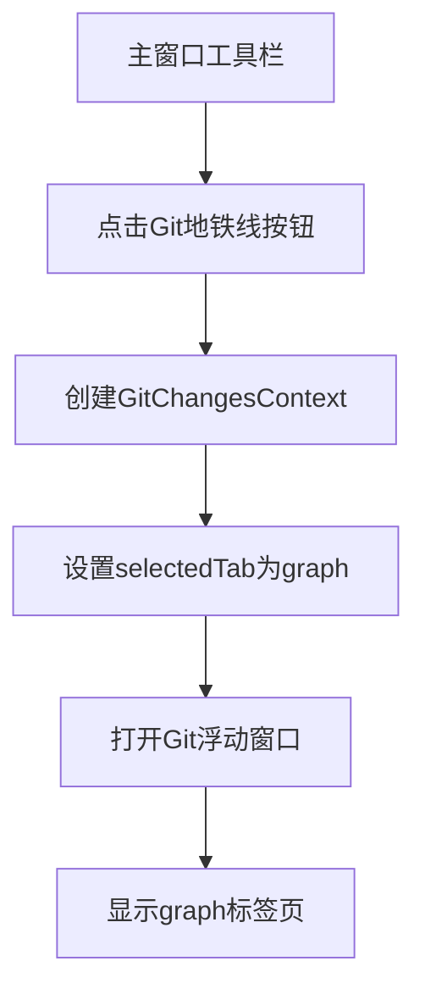

# 修复Git浮动窗口工具栏显示并添加主窗口入口

## 概述
1. Git浮动窗口的工具栏没有显示，原因是SwiftUI的`.toolbar` modifier在macOS上需要`NavigationStack`或`NavigationView`的支持。
2. 用户希望在主窗口工具栏中添加Git地铁线功能的快速入口。

## 当前实现
- `GitPanelWindowContentWithToolbar`使用`.toolbar` modifier定义工具栏，但`GitPanelWindowContent`视图没有被包装在导航容器中。
- Git浮动窗口通过设置`gitChangesContext`来打开，但没有主窗口工具栏的快速入口。

## 流程图

## 方案
**方案1：修改GitPanelWindowController接受初始标签页参数**
- 在GitPanelWindowController中添加initialTab参数
- 在GitPanelWindowContentWithToolbar中使用该参数设置初始标签页
- 在主窗口工具栏添加按钮，点击时创建GitChangesContext并设置selectedTab

**最终方案**：采用方案1

## 相关代码位置
- [GitPanelWindowController.swift:105](vscode://file/Volumes/Cache/codeeditAi/worktrees/1955-添加Git地铁线入口/aiX/Views/Worktree/Components/Git/GitPanelWindowController.swift:105) - GitPanelWindowContentWithToolbar初始化
- [WorktreeDetailView.swift:360](vscode://file/Volumes/Cache/codeeditAi/worktrees/1955-添加Git地铁线入口/aiX/Views/Worktree/WorktreeDetailView.swift:360) - leadingToolbarItems定义
- [RootView.swift:39](vscode://file/Volumes/Cache/codeeditAi/worktrees/1955-添加Git地铁线入口/aiX/Views/RootView.swift:39) - Git浮动窗口打开逻辑

## 代码错误测试
修改完成后，使用xcodebuild编译检查错误。

## 验证流程
1. 打开主窗口
2. 确认工具栏中Git地铁线按钮是否显示
3. 点击按钮，确认Git浮动窗口是否打开并显示graph标签页
4. 确认工具栏中的所有功能正常

## 任务总结与结论
通过以下修改实现功能：
1. 在GitPanelWindowContentWithToolbar中添加initialTab参数
2. 在主窗口工具栏添加Git地铁线按钮
3. 点击按钮时打开Git浮动窗口并切换到graph标签页

## 任务耗时
- 任务开始时间：1955
- 任务结束时间：2026
- 任务总耗时：31分钟