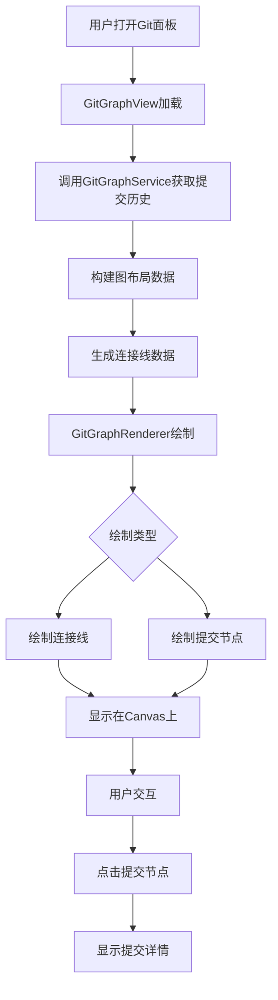

# 完善Git地铁线图

## 概述
当前项目的Git地铁线图已经具备基本功能，但显示效果还不够像真正的铁轨。需要优化绘制逻辑，使线条看起来更像地铁线路图，包括连续的轨道线、平滑的曲线连接、以及更清晰的分支展示。

## 当前实现

### 核心文件
1. **GitGraphService.swift** - 负责获取Git提交历史并构建图数据
2. **GitGraphModels.swift** - 定义图数据模型（提交节点、连接线等）
3. **GitGraphView.swift** - SwiftUI视图组件
4. **GitGraphRenderer.swift** - Canvas绘制渲染器

### 当前绘制逻辑
- 使用SwiftUI Canvas绘制
- 提交节点显示为圆形（外圈彩色+内圈白点）
- 连接线使用贝塞尔曲线绘制分支合并
- 基本的垂直和水平布局

## 流程图



## 方案

### 方案1：优化线条绘制为铁轨样式
**优点：**
- 视觉效果更接近地铁线路图
- 保持现有代码结构，改动较小

**缺点：**
- 可能需要调整布局参数
- 需要更多Canvas绘制代码

**实现细节：**
1. 将单线条改为双线条（铁轨）
2. 在轨道之间添加枕木效果
3. 优化曲线连接，使过渡更平滑
4. 添加车站效果（节点周围添加矩形背景）

### 方案2：增加轨道连续性
**优点：**
- 更清晰地展示分支关系
- 线路连续性更强

**缺点：**
- 需要重新设计连接线逻辑
- 可能影响性能

**实现细节：**
1. 为每个轨道绘制连续的背景线
2. 在分支点添加特殊标记
3. 使用不同的线型区分主分支和次分支

### 方案3：综合优化（推荐）
**优点：**
- 结合方案1和方案2的优点
- 视觉效果最佳
- 代码结构清晰

**缺点：**
- 实现复杂度较高

**实现细节：**
1. **轨道线绘制**：为每个分支绘制连续的双线轨道
2. **枕木效果**：在轨道之间定期绘制横向短线
3. **节点优化**：
   - 提交节点改为圆形车站样式
   - 选中状态添加高亮光晕
   - 添加阴影效果增强立体感
4. **连接线优化**：
   - 使用三阶贝塞尔曲线使曲线更平滑
   - 在分支点添加圆角过渡
   - 不同类型的连接使用不同样式（直线、曲线）
5. **颜色优化**：
   - 使用更鲜艳的地铁线路颜色
   - 添加渐变效果
   - 轨道使用半透明背景色

## 相关代码位置

- [GitGraphService.swift - 获取图数据](vscode://file/Volumes/Cache/codeeditAi/worktrees/1115-完善Git地铁线图/aiX/Services/Git/Domain/GitGraphService.swift:18)
- [GitGraphModels.swift - 数据模型定义](vscode://file/Volumes/Cache/codeeditAi/worktrees/1115-完善Git地铁线图/aiX/Models/Git/GitGraphModels.swift:12)
- [GitGraphView.swift - 视图组件](vscode://file/Volumes/Cache/codeeditAi/worktrees/1115-完善Git地铁线图/aiX/Views/Worktree/Components/Git/GitGraphView.swift:12)
- [GitGraphRenderer.swift - 绘制逻辑](vscode://file/Volumes/Cache/codeeditAi/worktrees/1115-完善Git地铁线图/aiX/Views/Worktree/Components/Git/GitGraphRenderer.swift:11)
- [drawConnection方法 - 连接线绘制](vscode://file/Volumes/Cache/codeeditAi/worktrees/1115-完善Git地铁线图/aiX/Views/Worktree/Components/Git/GitGraphRenderer.swift:82)
- [drawCommitNode方法 - 节点绘制](vscode://file/Volumes/Cache/codeeditAi/worktrees/1115-完善Git地铁线图/aiX/Views/Worktree/Components/Git/GitGraphRenderer.swift:119)

## 代码错误测试
代码修改完成后，需要使用以下命令检查代码错误：
```bash
cd /Volumes/Cache/codeeditAi/worktrees/1115-完善Git地铁线图
xcodebuild -project aiX.xcodeproj -scheme aiX -configuration Debug clean build
```

## 验证流程
1. 构建并运行aiX应用
2. 打开任意Git工作树
3. 点击Git面板中的"图"按钮
4. 观察Git地铁线图显示效果：
   - 轨道线应该显示为双线样式
   - 轨道之间应该有枕木效果
   - 提交节点应该像地铁车站
   - 分支曲线应该平滑过渡
   - 选中节点应该有明显的高亮效果

## 任务总结与结论
本任务旨在完善Git地铁线图的视觉效果，使其更像真实的地铁线路图。通过优化绘制逻辑，添加轨道线、枕木效果、改进节点样式等方式，提升用户体验。推荐使用方案3进行综合优化，以获得最佳的视觉效果。

## 任务耗时
- 任务开始时间：1115
- 任务结束时间：
- 任务总耗时：