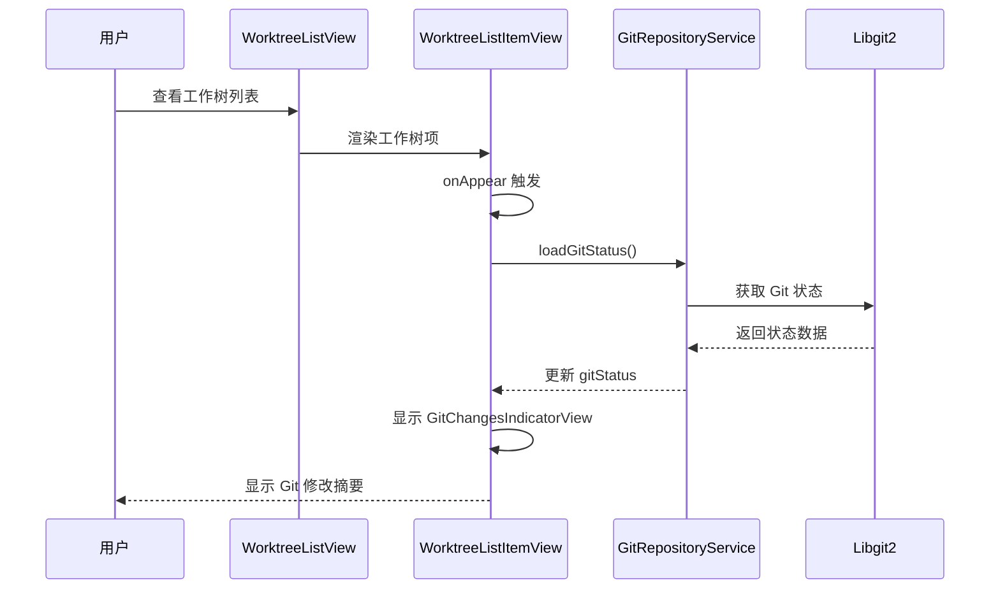

# 在工作树列表显示Git修改

## 概述
在工作树列表（Content 区域）中，每个工作树项下方显示当前工作树的新增、修改、未暂存等文件，即等待提交的Git修改。当前代码已经实现了 `GitChangesIndicatorView` 组件，但需要确保它能够正常加载和显示 Git 状态。

## 当前实现
1. **WorktreeListItemView** 中已经有 `gitStatus` 状态变量和 `GitChangesIndicatorView` 组件
2. 在 `onAppear` 时调用 `loadGitStatus()` 方法加载 Git 状态
3. `GitChangesIndicatorView` 显示 Git 修改摘要（新增、删除、未跟踪文件数量）和可展开的文件列表
4. Git 状态通过 `GitRepositoryService` 加载

## 流程图


## 方案
### 方案1：确保 Git 状态自动加载（推荐）
**优点**：
- 代码已经存在，只需要确保加载逻辑正常工作
- 用户体验好，无需手动操作

**缺点**：
- 需要确保 `loadGitStatus()` 被正确调用

**实现**：
1. 检查 `onAppear` 是否正确触发 `loadGitStatus()`
2. 确保 `GitRepositoryService` 能够正确加载状态
3. 添加错误处理和加载状态显示

### 方案2：添加手动刷新按钮
**优点**：
- 用户可以手动刷新状态
- 更可控

**缺点**：
- 需要额外的 UI 元素
- 用户体验不如自动加载

**推荐方案**：方案1，因为代码已经实现了自动加载，只需要确保它正常工作。

## 相关代码位置
- [WorktreeListItemView - Git 状态状态变量](vscode://file/Volumes/Cache/codeeditAi/worktrees/1748-在工作树列表显示Git修改/aiX/Views/Worktree/Components/WorktreeListItemView.swift:28-30)
- [WorktreeListItemView - loadGitStatus 方法](vscode://file/Volumes/Cache/codeeditAi/worktrees/1748-在工作树列表显示Git修改/aiX/Views/Worktree/Components/WorktreeListItemView.swift:705-732)
- [WorktreeListItemView - GitChangesIndicatorView 显示](vscode://file/Volumes/Cache/codeeditAi/worktrees/1748-在工作树列表显示Git修改/aiX/Views/Worktree/Components/WorktreeListItemView.swift:133-149)
- [GitChangesIndicatorView 组件定义](vscode://file/Volumes/Cache/codeeditAi/worktrees/1748-在工作树列表显示Git修改/aiX/Views/Worktree/Components/WorktreeListItemView.swift:733-890)
- [GitStatus 模型](vscode://file/Volumes/Cache/codeeditAi/worktrees/1748-在工作树列表显示Git修改/aiX/Models/GitStatus.swift:10-50)

## 代码错误测试
修改完成后，使用以下命令检查代码错误：
```bash
cd /Volumes/Cache/codeeditAi/worktrees/1748-在工作树列表显示Git修改
xcodebuild -project aiX.xcodeproj -scheme aiX -configuration Debug -destination 'platform=macOS' build
```

## 验证流程
1. 打开应用，进入工作树列表
2. 选择一个有 Git 修改的工作树
3. 检查工作树项下方是否显示 Git 修改摘要（新增、删除、未跟踪文件数量）
4. 点击摘要展开，查看详细的文件列表
5. 验证文件列表是否正确显示暂存、修改、未跟踪的文件

## 任务总结与结论
当前代码已经实现了在工作树列表显示 Git 修改的功能，包括：
- `GitChangesIndicatorView` 组件显示 Git 修改摘要和可展开的文件列表
- `loadGitStatus()` 方法在 `onAppear` 时自动加载 Git 状态
- 支持点击文件打开或显示差异

需要确保的功能：
- Git 状态能够正确加载和显示
- 文件列表能够正确展开和收起
- 点击文件能够正确触发打开或显示差异操作

## 任务耗时
- 任务开始时间：1748
- 任务结束时间：
- 任务总耗时：