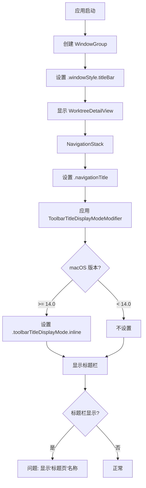

# 修复Tab栏显示标题页名称

## 概述
在 Tab 栏上会显示"标题页"名称，需要修复使其不显示。通过分析代码发现，当前代码已经使用了 `.navigationTitle("")` 和 `.toolbarTitleDisplayMode(.inline)` 来隐藏标题栏中的标题显示，但在某些情况下仍然会显示"标题页"名称。

## 当前实现

### 代码分析

1. **WorktreeDetailView.swift** (L670-671):
   ```swift
   NavigationStack {
       navigationContent
           .navigationTitle("")
           .modifier(ToolbarTitleDisplayModeModifier())
   }
   ```

2. **ToolbarTitleDisplayModeModifier** (L1011-1018):
   ```swift
   struct ToolbarTitleDisplayModeModifier: ViewModifier {
       func body(content: Content) -> some View {
           if #available(macOS 14.0, *) {
               content.toolbarTitleDisplayMode(.inline)
           } else {
               content
           }
       }
   }
   ```

3. **aiXApp.swift** (L122):
   ```swift
   .windowStyle(.titleBar)
   ```

### 问题分析

当前代码已经尝试隐藏标题栏中的标题显示：
- 使用 `.navigationTitle("")` 设置空标题
- 使用 `.toolbarTitleDisplayMode(.inline)` 在 macOS 14.0+ 上使用内联模式

但是，`.windowStyle(.titleBar)` 仍然会显示标题栏，而 `.navigationTitle("")` 可能不足以完全隐藏某些系统默认显示的文本。

在 macOS 中，当使用 `.windowStyle(.titleBar)` 时，系统可能会显示默认的窗口标题，特别是当 `.navigationTitle()` 设置为空字符串时。

## 流程图



## 方案

### 方案1：使用 `.windowStyle(.hiddenTitleBar)` (推荐)

将 `.windowStyle(.titleBar)` 改为 `.windowStyle(.hiddenTitleBar)`，这样可以完全隐藏标题栏。

**优点**:
- 完全隐藏标题栏，不会显示任何文本
- 简单直接，只需修改一处代码

**缺点**:
- 用户无法拖动标题栏来移动窗口（但仍然可以通过拖动窗口边缘或其他区域来移动）
- 可能会影响一些与标题栏相关的系统功能

### 方案2：使用 `.windowResizability(.contentSize)` 配合 `.toolbarTitleDisplayMode(.inline)`

保持 `.windowStyle(.titleBar)`，但确保 `.toolbarTitleDisplayMode(.inline)` 正确应用，并添加 `.toolbarBackground(.hidden, for: .windowToolbar)`。

**优点**:
- 保留标题栏，但隐藏标题显示
- 仍然可以拖动标题栏来移动窗口

**缺点**:
- 可能仍然会显示某些系统默认文本
- 需要更多的修改和测试

### 方案3：使用 `.navigationTitle()` 设置一个不可见的标题

将 `.navigationTitle("")` 改为 `.navigationTitle(" ")`（一个空格），或者使用 `.navigationBarHidden(true)`。

**优点**:
- 简单的修改
- 不需要改变窗口样式

**缺点**:
- 可能仍然会显示空格或其他文本
- `.navigationBarHidden(true)` 在 macOS 上的效果可能不如预期

### 推荐方案

**推荐方案1**：使用 `.windowStyle(.hiddenTitleBar)`

这是最简单直接的解决方案，可以完全隐藏标题栏，不会显示任何文本。

## 相关代码位置

- [aiXApp.swift:122](vscode://file/Volumes/Cache/codeeditAi/aiX/App/aiXApp.swift:122)
- [WorktreeDetailView.swift:670-671](vscode://file/Volumes/Cache/codeeditAi/aiX/Views/Worktree/WorktreeDetailView.swift:670)
- [WorktreeDetailView.swift:1011-1018](vscode://file/Volumes/Cache/codeeditAi/aiX/Views/Worktree/WorktreeDetailView.swift:1011)

## 代码错误测试

代码修改完成后，需要使用以下命令检查代码错误：

```bash
cd /Volumes/Cache/codeeditAi/worktrees/2254-修复Tab栏显示标题页
xcodebuild -scheme aiX -configuration Debug clean build
```

或者使用项目的 lint 命令（如果有的话）。

## 验证流程

1. 修改 aiXApp.swift 中的 `.windowStyle(.titleBar)` 为 `.windowStyle(.hiddenTitleBar)`
2. 编译并运行应用
3. 检查 Tab 栏上是否还显示"标题页"名称
4. 确认窗口仍然可以正常使用（包括移动窗口、调整大小等）

## 任务总结与结论

通过分析代码发现，当前代码已经尝试隐藏标题栏中的标题显示，但 `.windowStyle(.titleBar)` 仍然会显示标题栏，系统可能会显示默认的窗口标题。推荐使用 `.windowStyle(.hiddenTitleBar)` 来完全隐藏标题栏，这样可以彻底解决显示"标题页"名称的问题。

## 任务耗时
- 任务开始时间：2254
- 任务结束时间：
- 任务总耗时：